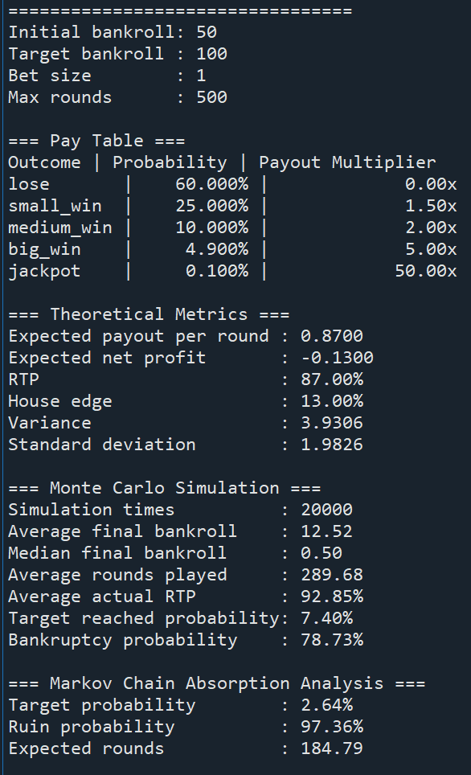

# Probability Game Engine Simulator

以 Python 建立的遊戲機率模型分析工具，透過機率建模、理論值分析、Monte Carlo Simulation 與 Markov Chain，驗證遊戲機率設計的合理性，並分析玩家長期資金變化與風險。

> 本專案僅作為機率建模、統計分析與風險評估的作品展示，不涉及任何真實博弈或金流系統。

---

## 專案介紹

本專案以簡化版遊戲機率模型為例，建立完整的 Pay Table（機率表），分析遊戲的長期數學特性。

玩家每回合投入固定成本（Bet Size），系統依照預先設定的機率權重隨機產生結果，並根據不同賠率計算回饋金額與資金變化。

除了理論分析之外，專案亦透過大量 Monte Carlo Simulation 驗證理論值，並利用 Markov Chain 分析玩家資金狀態的長期變化，估算目標達成率、破產機率及平均遊戲局數。

本專案重點並非模擬特定遊戲，而是展示機率建模、統計分析、風險評估與數學模型的完整分析流程。

---

## 模型假設

本專案採用簡化版遊戲模型：

* 每回合投入固定 Bet Size
* 每回合依照 Pay Table 隨機產生遊戲結果
* 不同結果具有不同的賠率（Payout Multiplier）
* 每回合資金變化 = 回饋金額 − 投注成本

此模型主要用於展示機率分析流程，因此不針對任何特定遊戲規則進行模擬。

---

## 功能說明

### Pay Table 建模

建立遊戲結果（Outcome），並設定：

* 出現機率（Probability）
* 賠率（Payout Multiplier）
* 每回合淨收益（Net Profit）

程式會自動驗證所有機率總和是否為 100%，避免機率表設定錯誤。

---

### 理論值分析

依據機率表計算遊戲的重要統計指標，包括：

* Expected Value（期望值）
* Expected Payout（平均回饋）
* RTP（Return to Player）
* House Edge（莊家優勢）
* Variance（變異數）
* Standard Deviation（標準差）

透過上述指標，可從數學角度分析遊戲設計是否符合預期。

---

### Monte Carlo Simulation

利用大量隨機模擬驗證理論模型，分析：

* 平均最終資金
* 中位數資金
* 平均遊戲局數
* 模擬 RTP
* 達成目標資金機率
* 破產機率

藉由大量樣本，比較理論值與實際模擬結果之間的差異。

---

### Markov Chain 分析

將玩家資金視為不同的狀態（State），建立吸收式馬可夫鏈（Absorbing Markov Chain）模型。

吸收狀態包含：

* 破產（Ruin）
* 達成目標資金（Target Bankroll）

透過狀態轉移分析，估算：

* 達成目標機率
* 破產機率（Risk of Ruin）
* 到達吸收狀態前的平均遊戲局數

---

## 執行畫面

執行程式後會輸出完整的 Pay Table、理論分析、Monte Carlo Simulation 與 Markov Chain 分析結果，方便比較理論值與模擬結果之間的差異。



---

## 執行方式

```bash
python probability_engine_simulator.py
```

---

## 使用技術

* Python
* Probability Modeling（機率建模）
* Expected Value
* RTP / House Edge
* Variance / Standard Deviation
* Monte Carlo Simulation
* Markov Chain
* Absorbing Markov Chain
* Risk of Ruin Analysis

---

## 專案特色

* 建立可調整的 Pay Table 機率模型
* 結合理論分析與 Monte Carlo Simulation 驗證模型
* 使用 Markov Chain 分析玩家資金狀態轉移
* 評估遊戲長期風險與機率表現
* 展示 Python 在機率建模、統計分析與數學模型上的實作能力

---

## 專案目的

本專案以簡化版遊戲機率模型為例，展示如何利用 Python 建立機率模型，並透過統計分析、Monte Carlo Simulation 與 Markov Chain 驗證理論結果，作為數學建模、風險分析與資料分析能力的作品展示。

---

## 聲明

本專案為個人學習與作品展示用途，主要用於機率建模、統計分析及風險評估，所有模型皆為簡化範例，不代表任何實際遊戲或商業系統。
